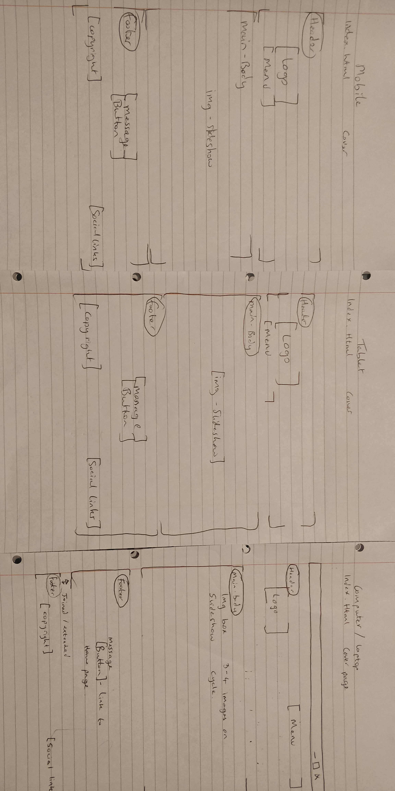
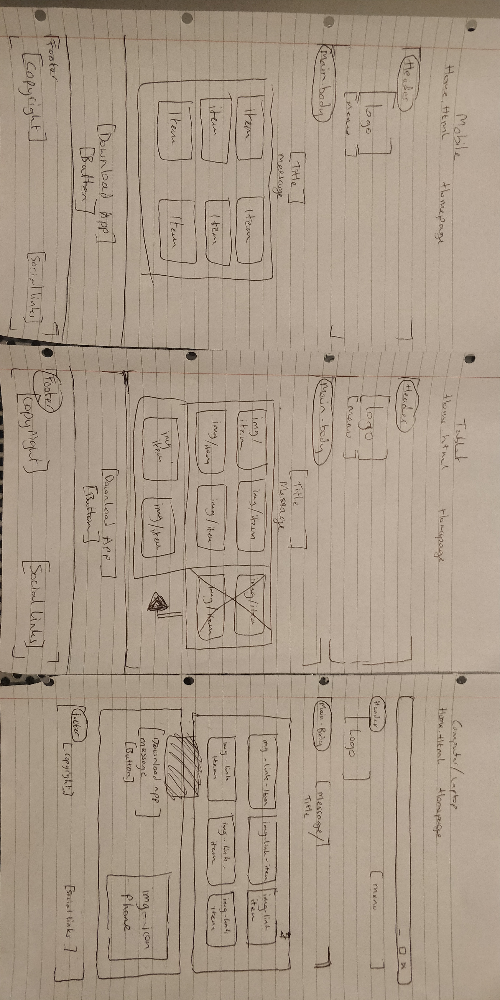
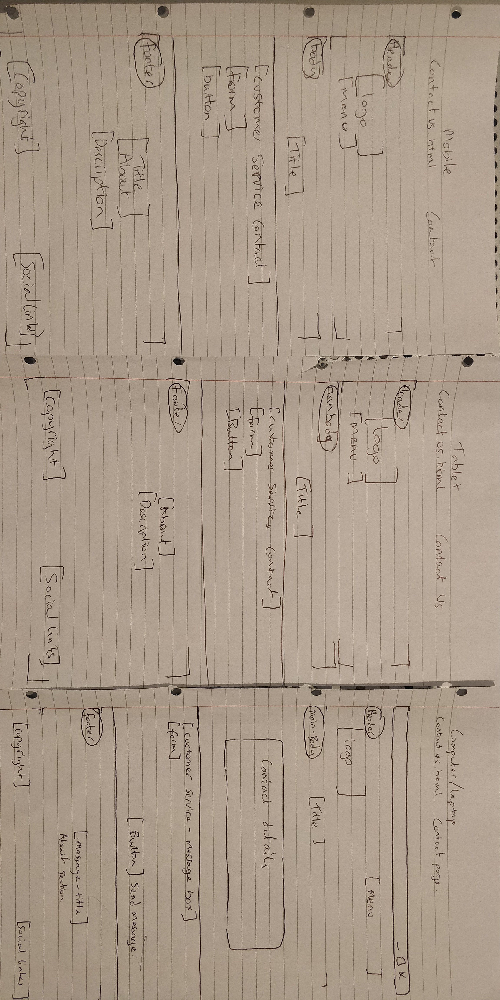
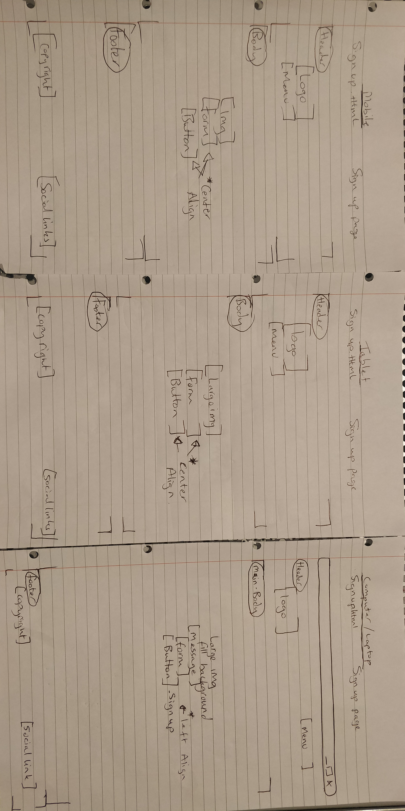

 

# Discover France

A wonderfully beautiful and popular travel destination with a rich cultural heritage could only be France. This country is a popular travel destination for several reasons, and it offers a diverse range of attractions and experiences that appeal to travelers from all over the world. Below are some key factors that contribute to France's popularity as a tourist destination:

- Rich History and Culture: France has a fascinating history and is home to many iconic landmarks and historical sites. From the Eiffel Tower and Louvre Museum in Paris to the Palace of Versailles and ancient Roman ruins in Provence, there's a wealth of cultural heritage to explore.

- Art and Architecture: France has been a center of art and architecture for centuries. Visitors can appreciate masterpieces by famous artists in museums like the Louvre and Musée d'Orsay, as well as admire stunning architectural wonders like Notre-Dame Cathedral and Mont Saint-Michel.

- Gastronomy: French cuisine is renowned worldwide for its elegance and diversity. From delicate pastries and world-class wines to savory cheeses and gourmet dishes, the culinary experiences in France are a delight for food lovers.

- Picturesque Landscapes: France offers breathtaking natural beauty, from the lavender fields in Provence to the stunning French Riviera coastline, the majestic Alps, and the picturesque countryside of regions like Normandy and the Loire Valley.

- Charming Villages: Quaint, charming villages dot the French countryside, providing a glimpse into traditional French life, culture, and architecture. These places are perfect for experiencing a slower pace and escaping the hustle of the city.

- Fashion and Shopping: France is a global fashion capital, known for its haute couture and luxury brands. Cities like Paris offer excellent shopping experiences for fashion enthusiasts.

- Wine and Vineyards: France is celebrated for its wine production, and regions like Bordeaux, Burgundy, and Champagne are must-visit destinations for wine aficionados.

- Festivals and Events: France hosts a wide range of festivals and events throughout the year, including the Cannes Film Festival, Bastille Day celebrations, Christmas markets, and numerous regional festivities.

- Easy Accessibility: France is well-connected with major international airports, making it accessible to travelers from all around the world. It also has an efficient train network, making it easy to explore different regions.

- Romantic Ambiance: France is often ass-ociated with romance, making it a top choice for honeymooners and couples seeking a romantic getaway.

The powerful concoction of history, culture, art, food, landscapes, and experiences makes France an irresistible destination for travelers seeking a mix of adventure, relaxation, and immersion in a captivating culture.

 

## Table of Contents

- [Project Overview](#project-overview)
- [Live Site](#live-site)
- [Repository](#repository)
- [Author](#author)
- [Target Audience](#target-audience)
- [Project Goals](#project-goals)
- [User Stories](#user-stories)
- [Website owner](#website-owner)
- [Developer](#developer)
- [Design choices](#design-choices)
- [Wireframes](#wireframes)
- [Features](#features)
- [Interactive Design Elements](#interactive-design-elements)
- [Implemented features](#implemented-features)
- [Future features](#future-features)
- [Version Control](#version-control)
- [Testing](#testing)
- [Accessibility Testing](#accessibility-testing)
- [Examples of Responsive design](#examples-of-responsive-design)
- [Defects list](#defects-list)
- [Outstanding defects](#outstanding-defects)
- [Technologies used](#technologies-used)
- [Deployment](#deployment)
- [Credits](#credits)
- [Content and Media](#content-and-media)
- [Acknowledgements](#acknowledgements)

 

## Project Overview

#### Welcome to Discover France

Are you ready to embark on an extraordinary journey to one of the world's most enchanting destinations? Look no further! Discover France, your ultimate tourism website, is here to take you on an unforgettable adventure through the wonders of this captivating country.

#### Why Choose Discover France?

At Discover France, we understand that travel is not just about visiting places; it's about creating lifelong memories and immersing yourself in a world of unparalleled beauty and cultural splendor. Our website is meticulously designed to cater to every traveler's dream, whether you're a history buff, an art enthusiast, a food lover, or a nature admirer.

#### Key Highlights:

- Immerse yourself in the Art and Culture: From the iconic Eiffel Tower to the majestic Palace of Versailles, uncover the secrets of France's past in awe-inspiring historical landmarks and museums, all-exclusive access to masterpieces by legendary artists in world-renowned museums like the Louvre and Musée d'Orsay.

- Savor Gastronomic Delights: Indulge your taste buds in a gastronomic adventure like no other, as you savor the delectable flavors of French cuisine, complemented by exquisite wines and cheeses.

- Explore Breathtaking Landscapes: Lose yourself in the picturesque landscapes of France, from the lavender fields of Provence to the stunning French Riviera coastline and the majestic Alps.

- Revel in Fashion and Shopping: Get your dose of fashion and style in the fashion capital of the world, Paris, and explore chic boutiques and luxury brands in this shopper's paradise.

- Celebrate the calendar events: Join in the vibrant celebrations of Cannes Film Festival, Bastille Day, Christmas markets, and more, as you become a part of the French joie de vivre.

#### Why Trust Discover France?

- Curated Itineraries: Our expert team has handcrafted diverse itineraries to cater to all interests, ensuring you get the most out of your trip.

- Local Insights: Benefit from insider tips and recommendations by locals, allowing you to discover hidden gems and unique experiences off the beaten path.

- Seamless Planning: Our user-friendly interface makes trip planning a breeze, with easy booking options for accommodations, tours, and more.

- Safe and Secure: Rest assured, your travel safety is our priority, and we provide essential travel information and support for a worry-free journey.

*Join Us on this Epic Journey!*

Embark on a mesmerizing adventure of a lifetime with Discover France - a celebration of culture, history, and beauty wrapped in an irresistible package. Let us be your trusted companion as you unravel the magic of this timeless destination. 

Start your journey today at https://mrhraza.github.io/Merci-France/index.html and be enchanted by the wonders that await you!

 

## Live Site

- https://mrhraza.github.io/Merci-France/index.html

 

## Repository

- https://github.com/MrHraza/Merci-France

 

## Author

Developer  -  *Husnain Raza*

 

## Target Audience

The target audience for my website, 'Discover France' would typically be individuals who are interested in travel, tourism, and exploring new destinations. More specifically, these include:

- Travel Enthusiasts: People who love to travel, explore different cultures, and experience new adventures.

- Tourists Planning a Trip to France: Individuals who are actively planning a trip to France and seeking information, guidance, and resources to make the most of their visit.

- Culture and History Buffs: Those who have an interest in history, art, architecture, and want to explore the rich cultural heritage of France.

- Food and Wine Lovers: People who appreciate fine cuisine, wine tasting, and the culinary delights that France has to offer.

- Nature and Adventure Seekers: Individuals who enjoy exploring natural landscapes, outdoor activities, and the diverse geography of France.

- Art and Museum Aficionados: Those with a passion for art, who wish to explore world-famous museums and galleries in France.

- Romantic Getaway Seekers: Couples looking for a romantic destination or honeymoon spot may be attracted to France's reputation as a romantic country.

- Photography Enthusiasts: People who love photography and want to capture the beauty of France's landscapes, architecture, and culture.

- Fashion and Shopping Enthusiasts: Individuals interested in fashion, luxury shopping, and haute couture, particularly in cities like Paris.

And lastly, Event and Festival Attendees: Those who want to experience and participate in cultural events, festivals, and celebrations or sporting events taking place in France.

 

## Project Goals

As a tourist website, are goals are to provide valuable information, inspire travelers, and facilitate their journey to France. Our key goals are to:

- Inform and Educate: provide a reliable source of comprehensive and up-to-date information about various destinations, attractions, activities, and practical travel tips in France. Visitors should be able to learn about the country's history, culture, traditions, and customs.

- Inspire and Engage: using compelling visuals, and immersive imagery to inspire travelers and ignite their curiosity about France. We find engaging content can encourage visitors to explore different regions and consider experiences they might not have initially thought of.

- Facilitate Trip Planning: Make it easy for travelers to plan their trip to France by providing well-organized itineraries, travel guides, and helpful resources. Offer information on accommodation options and transportation details.

- Encourage Interaction and Feedback: Create opportunities for visitors to interact with discover france website, such as leaving feedback to improve the user experience and address any concerns.

- Drive Engagement on Social Media: Integrate social media channels such as facebook, instagram and twitter.

 

## User Stories

#### user 1
As a frequent user of travel sites, I must express my frustration regarding the lack of direct communication with travel agents. It would be highly beneficial and improve my overall experience if I could easily reach out to a knowledgeable travel agent when planning my trips. While the online resources and information are helpful, there are times when I have specific questions or require personalized recommendations that are not addressed on the website.

Having the ability to communicate directly with a travel agent would offer me the peace of mind and assurance that I'm making the best decisions for my travel arrangements

#### user 2
I would like, *for once*, the chance to scroll through a travel website that **does not** bombard me with information from all directions! It's incredibly frustrating to visit travel sites in search of my dream vacation, only to be stunned with a chaotic jumble of images, pop-ups, ads, and text scattered all over the screen. 

Instead of feeling excited about planning my trip, I'm left feeling overwhelmed and stressed.

When I visit a travel website, I want a pleasant and enjoyable experience, not a sensory overload that makes it challenging to find the information I need. A cluttered website design with an excess of information not only slows down my browsing but also makes it difficult to focus on the aspects that truly matter to me.

#### user 3
I would like a website to be minimalistic in its design and user-friendly. A clutter-free interface with a clean layout and a simplistic navigation would be equivalent to a breath of fresh air. It should present the information I need in a straightforward manner, without unnecessary distractions or visual noise.

#### user 4
I would like to see a user-friendly travel website that would prioritize responsiveness and fast loading times. Waiting for pages to load or dealing with a sluggish website can be incredibly frustrating, especially when I'm excited to explore various destinations and plan my next adventure.

In addition, I wish for the website to have a clear and consistent color scheme and typography. This not only enhances the overall aesthetics but also contributes to a sense of professionalism and trustworthiness. It should be easy on the eyes, making it enjoyable to spend time on the site and discover new travel possibilities

#### user 5
I would like a website that allows me to easily view travel packages on my mobile device. Nowadays, more people are using their smartphones and tablets for travel planning, so having a mobile-responsive website, I believe is crucial. 

A mobile-friendly design would ensure that all the content, images, and navigation elements adjust perfectly to fit my mobile screen. This way, I can browse through travel packages, check out destination details, and compare options effortlessly while on the go.

In addition to a mobile-responsive layout, I would appreciate the option to sign up for a newsletter or receive regular email updates, keeping me informed about all the latest offers and deals. Having the most up-to-date information at my fingertips would be incredibly helpful in making well-informed decisions about my travel plans.

 

## Website owner

I want to be able to provide a simple and easy to use travel website, that has sufficient information for the layman to easily book an unforgettable trip to france. They should not be overloaded with information, and be able to navigate to the various areas of the website effortlessly. There should be a navigation system pleasing to the eye and easy enough for non-tech-literate individual to use. 

Users should be able to contact the travel team quickly through various methods. Users should also be able to access our website on a moblie or tablet device. They should receive a 5-star service, from home to destination with the website providing and promoting saftey and security through hospitable travel packages and travel guides and tips. Travellers should also be able to reach us on social media platforms. A method of keeping customers up-to date on our latest travel offers should also be available.

 

## Developer

As a Developer I want to push myself and demonstrate my ability in coding and also wish to learn about accessiblity in regards to programming, so that I am able to create websites that have the furthest reach.

 

## Design choices

#### Colours
The main colours of the website are *red (#e90000)*, *off-white (#fafafa)* and *blue (#09004b)*. These colours appear on the french flag and seemed a very obvious choice. Other colours that appear on the website are *Black (#000000)* used for text and shadows and a button. *Grey (#cac9c9)* is used to underline menu items as they are clicked or hovered over. *Light red (#d98c8c)* is used when social links are hovered over creating a contrast allowing users to see the icon the are currently on. **A pallet selected from [coolors.co](https://coolors.co) was not used.**

#### Typography
For my site I chose to use one font throughout. This was for the consistency element. 

The font was chosen from [**google fonts library**] https://fonts.google.com/specimen/Oswald?query=oswald.

"Oswald" is a clean and modern sans-serif font that offers a strong and professional look, making it suitable for a wide range of design styles.

Some reasons why I believe "Oswald" is a great font:

- **Readability**: "Oswald" is highly legible, making it easy for visitors to read and understand your website's content. Its clean and simple design ensures that the text remains clear, even on different screen sizes and resolutions.

- **Versatility**: This font's versatility allows it to work well for both headings and body text. Its bold and distinct characters make headlines stand out, while its comfortable readability makes it ideal for longer paragraphs of content.

- **Modern and Professional**: "Oswald" exudes a modern and professional vibe, making it suitable for various industries and design themes. Whether your website focuses on travel, technology, or any other niche, this font will lend a polished and sophisticated appearance to your site.

- **Google Fonts Integration**: Since "Oswald" is available on Google Fonts, you can easily integrate it into your website without worrying about licensing or compatibility issues. This allows for a seamless user experience, as visitors won't need to download the font separately.

- **Responsive Design**: "Oswald" performs well on different devices and browsers, ensuring that your website maintains its visual appeal and readability across various platforms.

*It's an excellent foundation for creating an **engaging and user-friendly experience** for the website visitors.*

#### Imagery
I have used many icons across my website for *Visual Communication* as icons provide a quick and visually engaging way to convey information. They can represent ideas, actions, or concepts without the need for lengthy text explanations. This makes it easier for users, of my website, to grasp the content and navigate through the website efficiently. Also they have faster loading times compared to images, icons are typically lightweight and load quickly, contributing to faster page loading times. This will improve website performance and user satisfaction. All icons are taken from font awesomes' library. [fontawesome.com](https://fontawesome.com/v4/icons/)

Examples of icons used in my website.

The images used across the website are not random images. They are all purposeful. Images related to the country france. All less than 1MB each, taking into consideration loading times. 

#### Animations and Transitions
On my cover page Index.html, I have used a carousel, a user-friendly element, to increase visual appeal. It includes arrows either side of the images, allowing users to navigate forward or backward through the carousel at their own pace.

#### Site Structure
I have opted for a multiple-page website over a single-page site for a few reasons. 

A multiple-page website organizes content into separate pages, each dedicated to specific topics or sections. Here are a couple of my considerations for a multiple-page website; Content Organization, SEO Benefits.

Multiple pages allow for better content organization. Visitors can easily navigate to specific sections of interest without scrolling through unrelated content. Also in my plans for the future, each page can be optimized for specific keywords, improving search engine rankings and visibility.

Although there are good advantages for a multiple-page website it does not come without drawbacks. These are things like slower loading times and a complicated navigation system if it is not built properly. 

All in all I favoured a multiple-page website as this is more practical for my audience/users. 

 

## Wireframes

- Cover page

- Home page

- Contact us page

- Sign up page

Other pages on the website *without* a wireframe; Thankyou.html, 404.html. These two pages do not have a wireframe as they have a simple, minimal and expected design with all text located in one central position. 

Artculture.html - this is the only page from the submenu, located on the homepage, that has been created. It doesn't have a wireframe because it is an example webpage.

 

## Features

My understanding from the user stories was that travelling as a whole is stressful and made more difficult by the websites that offer the deals/packages. They are often further made difficult by bad fonts and an overload of information. They are not made for responsive devices. Users are not able to make or sustain any contact with the travel agency. Also there was an inability to communicate problems and generally navigation was hard. 

**To combat this I have focused my attention on certain aspects to eleviate these problems, namely:**
- An easy and simple to use menu, 3 of the most important pages are located at the top. (homepage, contact us, sign up)
- easy to read, consistant and professional font throughout the website.
- large and easy to navigate submenu located on the homepage. This is made using universally recognised icons.
- a minimalistic style to combat the convaluted space that is a travel homepage. This was made consistant throughout the website.
- a contact us/customer service form, this was made for both feedback and help.
- sustained contact can be made via the sign-up form. Users will receive regular emails from discover france.
- the website can be accessed easily on a mobile or tablet device, keeping the minimalistic style on both these devices.

I have tried my utmost best to address user issues regarding travel websites.

 

## Interactive Design Elements

#### Menu
The main menu is located in the header of the page horizontally placed. The current page a user is browsing is underlined (see image).

If a user then hovers over another page in the menu, then this will also temporarily underline, though this is subject to their mouse input/movement over the menu items (see image).

#### Buttons
All buttons across the website are interactive, they invert colours when the user hovers over them (see example images before & after)

*before*

*after*

#### Social media icons
Social media icons, facebook, twitter and instagram are all hyperlinked to their respective websites and when the user hovers over them they highlight. 
In the screenshot twitter has been hightlighted as the mouse hovers over the icon.

#### Carousel
I have included in my website a carousel which has arrows allowing users to scroll through images themselves, if you hover over the arrow(left or right), the arrow highlights in white, whilst the other arrow remains a dull grey. ((see image). Right, is white as the user hovers over it whilst the other arrow remains dull grey, left)  

#### Submenu 
Located on the homepage, is a simple and easy-to-use submenu. A clever css trick with shadows allows the user to see which submenu item they are on. As the mouse hovers over an item a subtle shadow appears, aswell as the aesthetic nature, this is to confirm to the users where on the submenu they are. 

See image below as the user hovers over the 'hotels and restaurants'

#### About
Users can read a summarised version of the company's (discover france) purpose or if they choose, read a more detailed version by clicking 'continue reading'.
(see image before & after)

*before*

*after*

#### Contact us form, Sign up form
On two seperate pages, contact us.html and sign up.html I have forms that allow the users to fill out personal details and submit. (see images)

Contact us form

Sign up form

Thank you page is shown after the sign up form is completed

Custom 404.html

 

## Implemented features

#### Header

*Priority* - Establish logo and create an easy main navigation

*Logo* - linked back to the homepage, as this is intuitive as a lot of websites work this way
Menu is responsive - menu wraps beneath the logo. I have opted to do this as there are three links and I wanted to make this easy to use for non-techy people who may not know how to use the burger icon. 
I did consider navbar being fixed at top when scrolling but decided this may confuse elderly users.

#### Footer

*Keeping with a minimalistic style* - I opted not to put many links in the footer only social media links avaialble and opening in a new tab

#### Cover page (index.html)

*Capture the attention of my audience* - I chose to use this page as an entrance to my website. It was made simple with a carousel of captivating images and a simple message and explore button in the footer.

**Note**
By design the cover page is not meant to be a page you can visit whilst browsing on the website. It is the initial page to attract attention. It only contains a few images and a button linking to the homepage.

#### Homepage

*Submenu* - The homepage displays a large submenu with *links to come in the future* to other pages.

*Download app* - below the submenu I have chosen to add a 'download app' section another future endeavour. Currently the download button links to the Apple appstore.

#### Contact us 

*Contact information* - Here the users can find an email, phone and address to the company if they wish to write a letter.

*Customer service form* - Complaints, feedback, general help questions can be made here. 

*About section* - Re-affirming our mission and hospitality, I chose to place the about section here. As it is a strong message to say we strive to provide the very best.

*User information* - Input fields are all made mandatory to fill if the user is using the form.

#### Sign up

*Receive update* - the choice is given to sign up and receive great offers from the company convienently to the users inbox.

*Sustain contact* - Many users complained of not being able stay in contact with their travel agencies here is a solution. A member will be given priority.

*Confirmation* - Users receive confirmation of their signing up. 

*User information* - Input fields are all made mandatory to fill if the user is using the form.

#### Custom 404 error page
A simple error message with redirection to the homepage and contacts us page.

 

## Future features

#### Improve navigation
- Voice-enabled search and navigation.

#### Submenu on homepage
- More linked pages need to be added.
- Images instead of icons

#### Download app
- An app could be introduced

#### Live chat
- A live chatbot could be introduced to help users.
- Live video chat with travel agents for instant support.

#### SMS messages
- Users who sign up could choose to receive sms messages and or emails.

#### Gallery
- A gallery could be added to the website either the company uses their own images or gives users an opportunity to upload their photos.
- Interactive 360-degree images of accommodations and attractions.

#### Testimonials
- User experiences/feedback that will be published to the public.

#### AI-Powered Travel Assistant for personalized trip planning
- Users could maximize their experience and use of the website with AI assistance.
- Real-time flight and accommodation price tracking.

#### Weather updates
- Real-time weather updates for planned travel dates.

#### Use of analytics
- Personalized travel deals based on user behavior and history.

#### Exchange rate check
- Dynamic currency converter for real-time exchange rates.

#### Smart Travel Assistant
- Integration with smart home devices for seamless travel preparations. (something like Alexa or Siri)

#### User Travel Safety check
- Travel risk assessment and safety alerts for destinations.
  
#### Sign up/Membership Usage
- Subscription-based travel memberships for exclusive perks.
  
#### Events 
- Live streaming of travel-related events and conferences.
  
#### Improvement on Travel Tips
- Virtual travel workshops and classes.
  
#### Eco-friendly Systems
- Integration with carbon offset programs for eco-conscious travel.
  

*I firmly believe that the future of travel websites lies in innovation and meeting the evolving needs of travelers. These future features can revolutionize the company Discover france and travel as a whole, providing unique and personalized experiences for users seeking to explore france **and by extention, the world**.*

 

## Version Control

I realise and apologise for the defiencey in commits in this project. I have had many issues first with codeanywhere - not being able to link up. I sought out help but it was taking up my coding time. As I am in full-time employment, I don't have much time to code when I return from a 8-hour shift. Thus I did not have the time to waste fiddling with this issue. 

I was shown to gitpod where I encountered a second issue of not being able to open my code in the browser - kept getting an error message. I downloaded Visual Studio on desktop and whenever I completed a large enough section/page of code I copied and pasted the entire code in gitpod browser and committed it. Furthermore I completed my readme on github, and coded my website on visual studio, coding on two different places created branches. I was then required to merge these branches. 

I acknowledge that this isn't the way to do things, and having contemplating leaving the course because of the frustration it caused. I decided to sidestep issues for now and get the project done and meet the deadline.

In future projects, I intend to give time to resolve the issue and I will commit regularly and I do realise that commiting regularly is important for the demonstration in projects and actual employment.

Hoping you understand the struggle!

 

## Testing

### Validation

**CSS Validation**

**HTML Validation**

- index.html

  
- home.html

- contactus.html

  
- signup.html

  
- Thankyou.html

- 404.html

### Tested All pages 

**Desktop**

| Aspect        | Result         | Comment  |
| ------------- |:-------------:| -----:|
| Webpages load | Yes |  |
| Layout appearances are correct | Yes |  |
| Scroll works | Yes |  |
| Logo link works | Yes |  |
| Java element works | Yes |  |
| All menu links work | Yes |  |
| Hover features work | Yes |  |
| Buttons work | Yes |  |
| Forms work | Yes |  |
| Footer links work | Yes |  |

**Mobile**

| Aspect        | Result         | Comment  |
| ------------- |:-------------:| :----- |
| Webpages load | Yes |  |
| Layout appearances are correct | No | On small devices there is a gap visible at the bottom of the index page |
| Scroll works | Yes |  |
| Logo link works | Yes |  |
| Java element works | Yes |  |
| All menu links work | Yes |  |
| Hover features work | no | not coded for small/tablet devices |
| Buttons work | Yes |  |
| Forms work | Yes |  |
| Footer links work | Yes |  |

 

## Accessibility Testing

#### Colour contrast accessibility testing

- home.html

I chose to test this page because it has the three main colours of the website red, blue and white.

#### Lighthouse
 (1 - desktop ,  2 - Mobile)

 
- Index.html 

1) 
2) 

- Home.html

1) 
2) 

- Contactus.html

1) 
2) 

- Signup.html
  
1) 
2) 

- Thankyou.html

1) 
2) 

 

## Examples of Responsive design

- Iphone SE

note the menu and logo are designed to be left aligned **see code**

- Samsung Galaxy S20

- Samsung Galaxy A51/A71

- Ipad Mini

 

## Defects list

- Layout issues on small devices ( I tried very hard to sort this issue, unfortunately I ran out of time. This remains unresolved. )

 

## Outstanding defects

- On small screen devices the index page does not spread over 100% viewport height.

 

## Technologies used

#### Programming Languages
- CSS 
- HTML 
- *JS >>> I have made mention of this here because the carousel located on the homepage is Javascript, however there isn't code I can test or validate. It was a builtin feature of bootstrap. (SEE CODE)*
- Markdown

#### Frameworks and Extensions
- Bootstrap 4.2.1

#### Icons
- FontAwesome 4.7

#### Tools
- Github
- Gitpod
- Visual Studio
- Pen and paper
- Internet
- Markdown table of contents generator
- Favicon

 

## Deployment

#### Follow the steps to deploy on Github pages. 

1. In your repository, click on 'settings' in the navigation bar.
   
   

2. In the side menu, on the settings page, click pages (highlighted).
   

3. Select that which you want to deploy. (main)
   

4. Save and deploy options are then available to click.
5. You can find a link to your deployed website through 'Settings > Pages' or by clicking 'Environments' on the right-hand side of your repository page. 

 

## Credits

- Code Institute Lessons, HTML & CSS
- Code Institutes Love Running project
- Code Institutes Resume project
- Code Institutes Whiskey Drop project

 

## Content and Media

#### The following websites were visited for inspiration/ideas;

- https://visitqatar.com/
- https://www.awwwards.com/
- https://fonts.google.com/
- https://fonts.google.com/icons

#### Icons

- https://fontawesome.com/v4/icons/

#### All images were taken from;

- www.pexels.com - images on the website.
- www.pngegg.com - Favicon "french flag"

#### Code related ideas;

- www.csstricks.com - Shadows, Backdrop filter for blur
- Code Institutes Love Running project for the navigation bar
- https://www.w3schools.com/

 

## Acknowledgements

- CodeInstitute template
- **Malia Havlicek - mentor**
- Chrome Developer Tools
- https://www.w3schools.com/
- https://slack.com/
- https://ui.dev/amiresponsive
- https://jigsaw.w3.org/css-validator/
- https://validator.w3.org/
- Lighthouse
- Windows screen reader

